Statistics; Checking Assumptions
================
Marc A.T. Teunis
2019-05-23

References and sources
----------------------

This tutorial was inspired by the R Code for Chapter 5 of:

Field, A. P., Miles, J. N. V., & Field, Z. C. (2012).

`Discovering Statistics Using R: and Sex and Drugs and Rock 'N' Roll.`

London Sage (c) 2011 Andy P. Field, Jeremy N. V. Miles & Zoe C. Field

Assumptions
-----------

-   Each statistical test implies assumptions for the design, the structure, the distribution and the variance in the data
-   Selecting the wrong test for the wrong data will lead to over- or underestimation of statistical validity and probably to wrong conclusions
-   Assumptions can be checked by creating graphs and perfoming tests, there can be confusion!
-   Before checking assumptions we do `Exploratory Data Analysis`

The data
--------

-   Data from the book "Discovering Statitics Using R"
-   Case: Dataset supplied by Sacha Kofman (Enzazaden NL)

Install and Load Packages
-------------------------

``` r
# install.packages("car")
# install.packages("ggplot2")
# install.packages("pastecs")
# install.packages("psych")
library(car)
library(ggplot2)
library(pastecs)
library(psych)
# library(Rcmdr)
library(tidyverse)
```

Read in the download data:
--------------------------

``` r
dlf <- read_delim(file = file.path(root, 
                                   "data", 
                                   "DownloadFestival.dat"), 
                                   delim =  "\t", na = c("", " "))
dlf %>% head(3)
```

    ## # A tibble: 3 x 5
    ##   ticknumb gender  day1  day2   day3
    ##      <dbl> <chr>  <dbl> <dbl>  <dbl>
    ## 1     2111 Male    2.64  1.35  1.61 
    ## 2     2229 Female  0.97  1.41  0.290
    ## 3     2338 Male    0.84 NA    NA

Checking distribution and detecting outliers
--------------------------------------------

``` r
sum(is.na(dlf))
```

    ## [1] 1233

``` r
x <- summary(dlf)
min_maxs <- x[c(1, 6), c(3:5)] %>% unlist() %>% print()
```

    ##       day1             day2             day3       
    ##  Min.   : 0.020   Min.   :0.0000   Min.   :0.0200  
    ##  Max.   :20.020   Max.   :3.4400   Max.   :3.4100

Detecting an outlier with a histogram
-------------------------------------

``` r
hist.outlier <- ggplot(dlf, aes(day1)) + 
  geom_histogram(aes(y=..density..), 
                 colour="black", 
                 fill="white") + 
  labs(x="Hygiene score on day 1", y = "Density") +
  theme(legend.position = "none")
hist.outlier
```

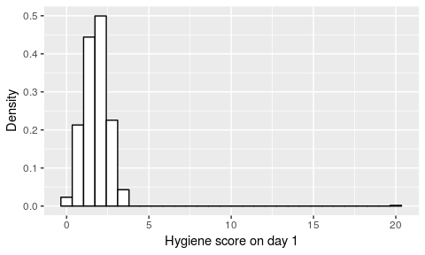

Transform data to a different format (convert to `long/stacked`)
----------------------------------------------------------------

``` r
dlf_long <- dlf %>% 
  tidyr::gather(day1:day3, key = "days", value = "hygiene_score")
```

Boxplots with outlier
---------------------

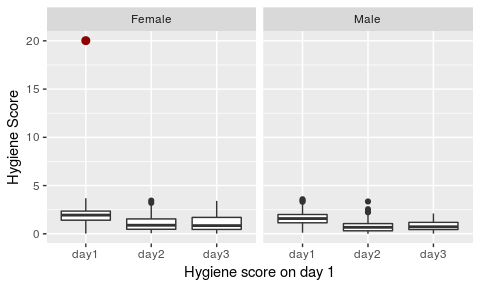

Remove outlier
--------------

``` r
dlf <- dlf %>%
  dplyr::filter(!day1 > 19)
```

Boxplots without outlier
------------------------

``` r
hist.boxplot <- dlf %>%
  tidyr::gather(day1:day3, key = "days", value = "hygiene_score") %>%
  ggplot(aes(x = days, y = hygiene_score)) + 
  geom_boxplot(aes(group = days)) + 
  labs(x="Hygiene score on day 1", y = "Hygiene Score") +
  theme(legend.position = "none") + 
  facet_wrap(~ gender)
hist.boxplot
```

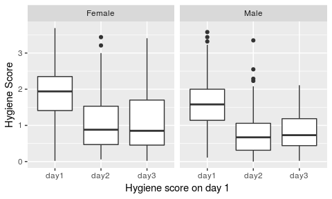

Histograms for hygiene scores on day 1, day 2 and day 3.
========================================================

Histogram for day 1:
--------------------

``` r
hist.day1 <- ggplot(dlf, aes(day1)) + 
  geom_histogram(aes(y=..density..), 
                 colour="black", 
                 fill="white") + 
  labs(x="Hygiene score on day 1", y = "Density") +
  theme(legend.position = "none")
  
hist.day1
```

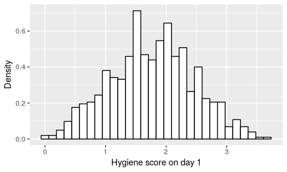

Histogram for day 2
-------------------

``` r
hist(dlf$day2)
```

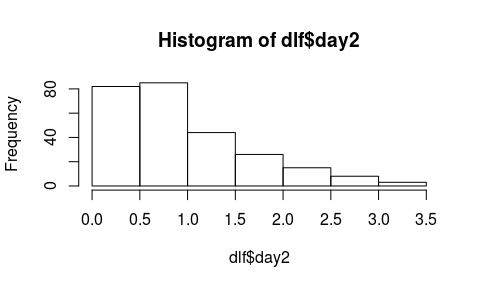

``` r
hist.day2 <- ggplot(dlf, aes(day2)) + 
  geom_histogram(aes(y=..density..), 
                 colour="black", 
                 fill="white") + 
  labs(x="Hygiene score on day 2", y = "Density") +
  theme(legend.position = "none")
hist.day2
```

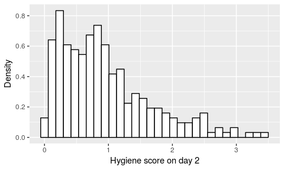

Histogram for day 3
-------------------

``` r
hist.day3 <- ggplot(dlf, aes(day3)) + 
  theme(legend.position = "none") + 
  geom_histogram(aes(y=..density..), 
                 colour="black", fill="white") + 
  labs(x="Hygiene score on day 3", y = "Density")
hist.day3
```


Panel of histograms + distribution density
------------------------------------------

``` r
cowplot::plot_grid(p1, p2, p3, nrow = 1)
```


Check for normality by graphs; qq-plot
======================================

Q-Q plot for day 1
------------------

``` r
qqplot.day1 <- qplot(sample = dlf$day1, geom = "qq")
qqplot.day1
```

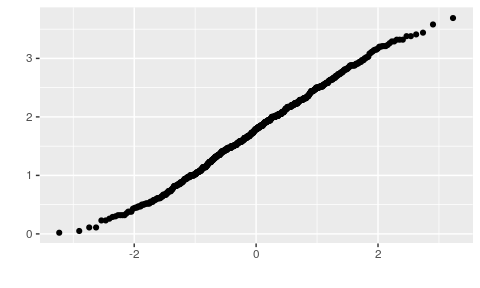

Or antoher way with a home brewed function in ggplot2
-----------------------------------------------------

``` r
source(file = file.path(root, "code", "ggqq.R"))
gg_qq_1 <- gg_qq(dlf$day1)
```

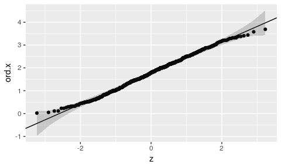

``` r
gg_qq_1
```

    ##      25%      75% 
    ## 1.770000 0.681997

Q-Q plot for day 2:
-------------------

``` r
qqplot.day2 <- qplot(sample = dlf$day2, geom = "qq")
qqplot.day2
```

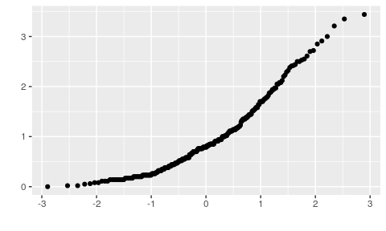

Or via the other alternative way
--------------------------------

``` r
gg_qq_2 <- gg_qq(dlf$day2)
```

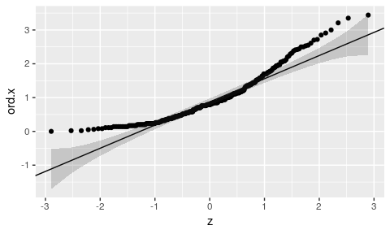

``` r
gg_qq_2
```

    ##       25%       75% 
    ## 0.8725000 0.6857035

Q-Q plot of the hygiene scores on day 3
---------------------------------------

``` r
qqplot.day3 <- qplot(sample = dlf$day3, geom = "qq")
qqplot.day3
```

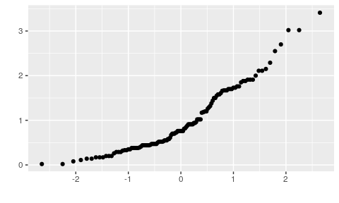

Or
--

``` r
gg_qq(dlf$day3)
```

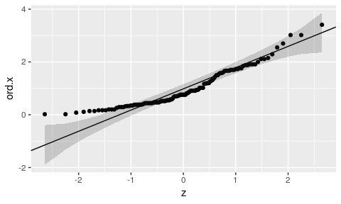

    ##       25%       75% 
    ## 0.9825000 0.8043117

Skewness and kurtosis
---------------------

Skewness and kurtosis are parameters that display the deviation from normality looking at the shape of the distribution polynom. A distribution with an absolute `skew.2SE` &gt; 1 is significantly skewed and not normal. A distribution with an absolute `kurt.2SE` &gt; 1 has significant kurtosis and is not normally distributed

`kurt.2SE` and `skew.2SE` are calculated from

-   *k**u**r**t*.2*S**E* = *k**u**r**t*/2 \* (*s**t**a**n**d**a**r**d*.*e**r**r**o**r*)
-   *s**k**e**w*.2*S**E* = *s**k**e**w*/2 \* (*s**t**a**n**d**a**r**d*.*e**r**r**o**r*)

`Shapiro-Wilk test`
-------------------

To test for normality we can use the `Shapiro-Wilk test`. This test checks whether the deviation from normality is significant (H0) or not (H1),

-   p-value &lt; 0.05 means that the distribution is significantly different from a normal distribution: assumption "the distribution is not normal"
-   p-value &gt; 0.05 means that the distribution is not significantly different from normal: assumption "the distribution is normal"

Quantifying normality with numbers
----------------------------------

``` r
library(psych)      
describe(dlf$day1)
```

    ##    vars   n mean   sd median trimmed mad  min  max range skew kurtosis
    ## X1    1 809 1.77 0.69   1.79    1.77 0.7 0.02 3.69  3.67    0    -0.42
    ##      se
    ## X1 0.02

Two alternative ways to describe multiple variables.
----------------------------------------------------

``` r
describe(cbind(dlf$day1, dlf$day2, dlf$day3)) %>% knitr::kable()
```

|     |  vars|    n|       mean|         sd|  median|    trimmed|       mad|   min|   max|  range|        skew|    kurtosis|         se|
|-----|-----:|----:|----------:|----------:|-------:|----------:|---------:|-----:|-----:|------:|-----------:|-----------:|----------:|
| X1  |     1|  809|  1.7708282|  0.6939127|    1.79|  1.7714946|  0.696822|  0.02|  3.69|   3.67|  -0.0031554|  -0.4239914|  0.0243967|
| X2  |     2|  263|  0.9552852|  0.7163274|    0.79|  0.8631280|  0.607866|  0.00|  3.44|   3.44|   1.0973144|   0.8293234|  0.0441706|
| X3  |     3|  123|  0.9765041|  0.7102770|    0.76|  0.9021212|  0.607866|  0.02|  3.41|   3.39|   1.0078127|   0.5945454|  0.0640435|

Second way
----------

``` r
knitr::kable(describe(dlf[,c("day1", "day2", "day3")]))
```

|      |  vars|    n|       mean|         sd|  median|    trimmed|       mad|   min|   max|  range|        skew|    kurtosis|         se|
|------|-----:|----:|----------:|----------:|-------:|----------:|---------:|-----:|-----:|------:|-----------:|-----------:|----------:|
| day1 |     1|  809|  1.7708282|  0.6939127|    1.79|  1.7714946|  0.696822|  0.02|  3.69|   3.67|  -0.0031554|  -0.4239914|  0.0243967|
| day2 |     2|  263|  0.9552852|  0.7163274|    0.79|  0.8631280|  0.607866|  0.00|  3.44|   3.44|   1.0973144|   0.8293234|  0.0441706|
| day3 |     3|  123|  0.9765041|  0.7102770|    0.76|  0.9021212|  0.607866|  0.02|  3.41|   3.39|   1.0078127|   0.5945454|  0.0640435|

`stat.desc()` to get descriptive statistics for a dataframe or a variable
-------------------------------------------------------------------------

``` r
library(pastecs)
stat.desc(dlf$day1, basic = FALSE, norm = TRUE)
```

    ##       median         mean      SE.mean CI.mean.0.95          var 
    ##  1.790000000  1.770828183  0.024396670  0.047888328  0.481514784 
    ##      std.dev     coef.var     skewness     skew.2SE     kurtosis 
    ##  0.693912663  0.391857702 -0.003155393 -0.018353763 -0.423991408 
    ##     kurt.2SE   normtest.W   normtest.p 
    ## -1.234611514  0.995907065  0.031838626

``` r
stat.desc(cbind(dlf$day1, dlf$day2, dlf$day3), basic = FALSE, norm = TRUE)
```

    ##                        V1           V2           V3
    ## median        1.790000000 7.900000e-01 7.600000e-01
    ## mean          1.770828183 9.552852e-01 9.765041e-01
    ## SE.mean       0.024396670 4.417064e-02 6.404352e-02
    ## CI.mean.0.95  0.047888328 8.697463e-02 1.267805e-01
    ## var           0.481514784 5.131250e-01 5.044934e-01
    ## std.dev       0.693912663 7.163274e-01 7.102770e-01
    ## coef.var      0.391857702 7.498572e-01 7.273672e-01
    ## skewness     -0.003155393 1.097314e+00 1.007813e+00
    ## skew.2SE     -0.018353763 3.653087e+00 2.309035e+00
    ## kurtosis     -0.423991408 8.293234e-01 5.945454e-01
    ## kurt.2SE     -1.234611514 1.385557e+00 6.862946e-01
    ## normtest.W    0.995907065 9.080040e-01 9.077516e-01
    ## normtest.p    0.031838626 1.290743e-11 3.804486e-07

``` r
round(stat.desc(dlf[, c("day1", "day2", "day3")], basic = FALSE, norm = TRUE), digits = 3)
```

    ##                day1  day2  day3
    ## median        1.790 0.790 0.760
    ## mean          1.771 0.955 0.977
    ## SE.mean       0.024 0.044 0.064
    ## CI.mean.0.95  0.048 0.087 0.127
    ## var           0.482 0.513 0.504
    ## std.dev       0.694 0.716 0.710
    ## coef.var      0.392 0.750 0.727
    ## skewness     -0.003 1.097 1.008
    ## skew.2SE     -0.018 3.653 2.309
    ## kurtosis     -0.424 0.829 0.595
    ## kurt.2SE     -1.235 1.386 0.686
    ## normtest.W    0.996 0.908 0.908
    ## normtest.p    0.032 0.000 0.000

R exam case
===========

The R exam data file `./data/RExam.dat` contains data on the performance of students on an R exam (data from Field et al., 2012). The variables:

This data consists of 5 variables:

-   `exam` first-year exams scores as a percentage (numeric / continous)
-   `computer` measure of computer literacy as a percentage (numeric / continuous)
-   `lectures` percentage of lectures in the R class attended, as a percentage (numeric / continuous)
-   `numerical` arbitrary score from 1-15 on the ability to cope with numbers ("statistical literacy") (integer / ordinal)
-   `uni` the university where the student taking the R class attends (factor)

Read in R exam data.
--------------------

``` r
rexam <- read_delim(file = file.path(root, "data", "RExam.dat"), delim = "\t")
rexam %>% head(3)
```

    ## # A tibble: 3 x 5
    ##    exam computer lectures numeracy   uni
    ##   <dbl>    <dbl>    <dbl>    <dbl> <dbl>
    ## 1    18       54     75          7     0
    ## 2    30       47      8.5        1     0
    ## 3    40       58     69.5        6     0

Set the variable `uni` to be a factor
-------------------------------------

``` r
library(forcats)
rexam <- rexam %>%
  mutate(uni = as.factor(uni)) %>%
  mutate(uni = forcats::fct_recode(uni, duncetown_university = "0", sussex_university = "1")) 
rexam %>% head(3)
```

    ## # A tibble: 3 x 5
    ##    exam computer lectures numeracy uni                 
    ##   <dbl>    <dbl>    <dbl>    <dbl> <fct>               
    ## 1    18       54     75          7 duncetown_university
    ## 2    30       47      8.5        1 duncetown_university
    ## 3    40       58     69.5        6 duncetown_university

Long format
-----------

``` r
rexam_long <- rexam %>%
  gather(exam:numeracy, key = "measure", value = "value")
rexam_long
```

    ## # A tibble: 400 x 3
    ##    uni                  measure value
    ##    <fct>                <chr>   <dbl>
    ##  1 duncetown_university exam       18
    ##  2 duncetown_university exam       30
    ##  3 duncetown_university exam       40
    ##  4 duncetown_university exam       30
    ##  5 duncetown_university exam       40
    ##  6 duncetown_university exam       15
    ##  7 duncetown_university exam       36
    ##  8 duncetown_university exam       40
    ##  9 duncetown_university exam       63
    ## 10 duncetown_university exam       31
    ## # … with 390 more rows

Normality test and skewness
---------------------------

``` r
round(stat.desc(rexam[, c("exam", "computer", "lectures", "numeracy")], 
                basic = FALSE, norm = TRUE), 
                digits = 3)
```

    ##                 exam computer lectures numeracy
    ## median        60.000   51.500   62.000    4.000
    ## mean          58.100   50.710   59.765    4.850
    ## SE.mean        2.132    0.826    2.168    0.271
    ## CI.mean.0.95   4.229    1.639    4.303    0.537
    ## var          454.354   68.228  470.230    7.321
    ## std.dev       21.316    8.260   21.685    2.706
    ## coef.var       0.367    0.163    0.363    0.558
    ## skewness      -0.104   -0.169   -0.410    0.933
    ## skew.2SE      -0.215   -0.350   -0.849    1.932
    ## kurtosis      -1.148    0.221   -0.285    0.763
    ## kurt.2SE      -1.200    0.231   -0.298    0.798
    ## normtest.W     0.961    0.987    0.977    0.924
    ## normtest.p     0.005    0.441    0.077    0.000

Histograms of all variables
===========================

Histogram for all data together
-------------------------------

``` r
all_data_hist <- rexam_long %>%
  ggplot(aes(value)) + 
  geom_histogram(aes(y=..density..), 
                colour="black", fill="white")
all_data_hist
```

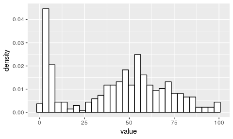

`exam` histogram
----------------

``` r
hexam <- ggplot(rexam, aes(exam)) + 
  geom_histogram(aes(y=..density..), 
                colour="black", fill="white") + 
  labs(x = "First Year Exam Score", 
                y = "Density") + 
  stat_function(fun = dnorm, 
                args = list(mean = mean(rexam$exam, na.rm = TRUE), 
                sd = sd(rexam$exam, na.rm = TRUE)), 
                colour = "red", size = 1) + 
  theme(legend.position = "none") 
hexam
```

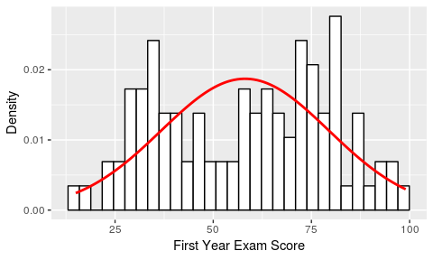

`computer` histogram
--------------------

``` r
hcomputer <- ggplot(rexam, aes(computer))  + 
  geom_histogram(aes(y=..density..), 
                 colour="black", 
                 fill="white") + 
  labs(x = "Computer Literacy", 
                 y = "Density") + 
  stat_function(fun = dnorm, 
                 args = list(mean = mean(rexam$computer, na.rm = TRUE), 
                 sd = sd(rexam$computer, na.rm = TRUE)), 
                 colour = "red", size = 1) + 
  theme(legend.position = "none")
hcomputer
```

`lectures`
----------

``` r
hlectures <- ggplot(rexam, aes(lectures)) + 
  geom_histogram(aes(y=..density..), 
                 colour="black", fill="white") + 
  labs(x = "Percentage of Lectures Attended", y = "Density") + 
  stat_function(fun = dnorm, 
                 args = list(mean = mean(rexam$lectures, na.rm = TRUE), 
                 sd = sd(rexam$lectures, na.rm = TRUE)), 
                 colour = "red", size = 1) + 
  theme(legend.position = "none")
hlectures
```

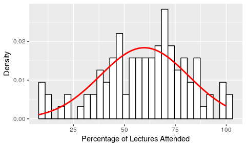

`numeracy`
----------

``` r
hnumeracy <- ggplot(rexam, aes(numeracy)) + 
  geom_histogram(aes(y=..density..), 
                 colour="black", fill="white") + 
  labs(x = "Numeracy", 
                 y = "Density") + 
  stat_function(fun = dnorm, 
                 args = list(mean = mean(rexam$numeracy, na.rm = TRUE), 
                 sd = sd(rexam$numeracy, na.rm = TRUE)), 
                 colour = "red", size = 1) + 
  theme(legend.position = "none")
hnumeracy
```

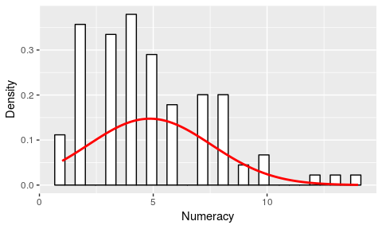

Using `{purrr}` to get statistics for many variables
====================================================

``` r
library(broom)
library(purrr)
```

`nest()` to get a list of dataframes
------------------------------------

``` r
names(rexam)
```

    ## [1] "exam"     "computer" "lectures" "numeracy" "uni"

``` r
rexam_by_var <- rexam %>%
  as_tibble() %>%
  gather(exam:numeracy, key = "measure", value = "value") %>%
  group_by(uni, measure) %>%
  nest()
rexam_by_var
```

    ## # A tibble: 8 x 3
    ##   uni                  measure  data             
    ##   <fct>                <chr>    <list>           
    ## 1 duncetown_university exam     <tibble [50 × 1]>
    ## 2 sussex_university    exam     <tibble [50 × 1]>
    ## 3 duncetown_university computer <tibble [50 × 1]>
    ## 4 sussex_university    computer <tibble [50 × 1]>
    ## 5 duncetown_university lectures <tibble [50 × 1]>
    ## 6 sussex_university    lectures <tibble [50 × 1]>
    ## 7 duncetown_university numeracy <tibble [50 × 1]>
    ## 8 sussex_university    numeracy <tibble [50 × 1]>

Adding a column with descriptive statistics with `mutate()`
-----------------------------------------------------------

``` r
rexam_descr <- rexam_by_var %>%
  mutate(descriptives = map(data, stat.desc, basic = TRUE, norm = TRUE))
rexam_descr
```

    ## # A tibble: 8 x 4
    ##   uni                  measure  data              descriptives     
    ##   <fct>                <chr>    <list>            <list>           
    ## 1 duncetown_university exam     <tibble [50 × 1]> <df[,1] [20 × 1]>
    ## 2 sussex_university    exam     <tibble [50 × 1]> <df[,1] [20 × 1]>
    ## 3 duncetown_university computer <tibble [50 × 1]> <df[,1] [20 × 1]>
    ## 4 sussex_university    computer <tibble [50 × 1]> <df[,1] [20 × 1]>
    ## 5 duncetown_university lectures <tibble [50 × 1]> <df[,1] [20 × 1]>
    ## 6 sussex_university    lectures <tibble [50 × 1]> <df[,1] [20 × 1]>
    ## 7 duncetown_university numeracy <tibble [50 × 1]> <df[,1] [20 × 1]>
    ## 8 sussex_university    numeracy <tibble [50 × 1]> <df[,1] [20 × 1]>

Shapiro:
--------

Getting the Shapiro-Wilk results: a function
--------------------------------------------

``` r
get_shapiro_wilk <- function(df){
  p_value <- df[ , 1][20]
  return(p_value)
}
```

Apply function to nested table and unnest
-----------------------------------------

``` r
rexam_descr <- rexam_descr %>%
  mutate(shap_wilk = map(descriptives, get_shapiro_wilk))
descriptives <- unnest(rexam_descr, shap_wilk)
descriptives[ , c("uni", "measure", "shap_wilk")]
```

    ## # A tibble: 8 x 3
    ##   uni                  measure  shap_wilk
    ##   <fct>                <chr>        <dbl>
    ## 1 duncetown_university exam       0.283  
    ## 2 sussex_university    exam       0.715  
    ## 3 duncetown_university computer   0.457  
    ## 4 sussex_university    computer   0.0193 
    ## 5 duncetown_university lectures   0.226  
    ## 6 sussex_university    lectures   0.626  
    ## 7 duncetown_university numeracy   0.0145 
    ## 8 sussex_university    numeracy   0.00679

Plot results Shapiro-Wilk test
------------------------------

``` r
descriptives[ , c("uni", "measure", "shap_wilk")] %>%
  ggplot(aes(x = measure, y = shap_wilk)) +
  geom_point(aes(colour = uni), size = 2) +
  geom_hline(yintercept= 0.05, linetype="dotted", size = 1.5)
```

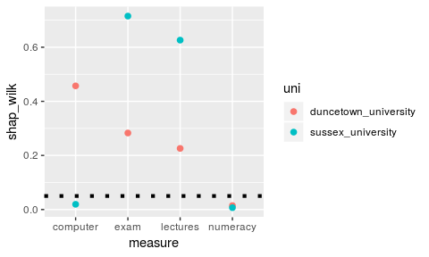

Plotting a histrogram for each `measure` and each university, using `facets`
----------------------------------------------------------------------------

``` r
hist_measure <- rexam_long %>%
    ggplot(aes(x = value)) +
  geom_histogram(aes(y = ..density..), 
                 fill = "white", 
                 colour = "black", 
                 binwidth = 1) + 
  labs(x = "Arbitrary Units", y = "Density") +
  facet_grid(uni ~ measure) 
#hist_measure
```

Plot `measure`
--------------

``` r
hist_measure
```

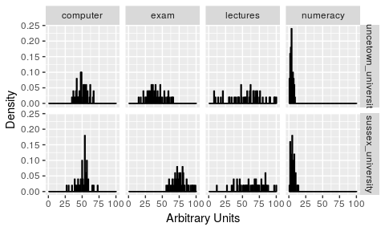

Plotting a histogram per `computer` using `dplyr::filter()`; `computer`
-----------------------------------------------------------------------

``` r
 hist_computer <- rexam_long %>%
  dplyr::filter(measure == "computer") %>%
    ggplot(aes(x = value)) +
  geom_histogram(aes(y = ..density..), 
                 fill = "white", 
                 colour = "black", 
                 binwidth = 1) + 
  labs(x = "Arbitrary Units", y = "Density") + 
  ggtitle("Computer literacy") +
  geom_line(aes(y = ..density..), colour=26, stat = 'density', size = 2, alpha = .6) +
  facet_wrap(~ uni)
```

Plot `computer`
---------------

``` r
hist_computer
```

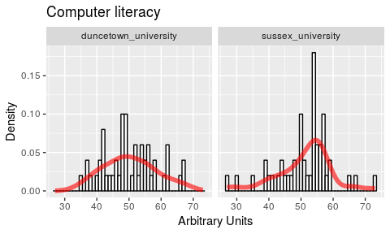

Plotting a histogram per group using `dplyr::filter()`; `exam`
--------------------------------------------------------------

``` r
plot_exam <- rexam_long %>%
  dplyr::filter(measure == "exam") %>%
    ggplot(aes(x = value)) +
  geom_histogram(aes(y = ..density..), 
                 fill = "white", 
                 colour = "black", 
                 binwidth = 1) + 
  labs(x = "Arbitrary Units", y = "Density") + 
  ggtitle("First year exam") +
  geom_line(aes(y = ..density..), colour=25, stat = 'density', size = 2, alpha = .6) +
  facet_wrap(~ uni)
```

Plot `exam`
-----------

``` r
plot_exam
```

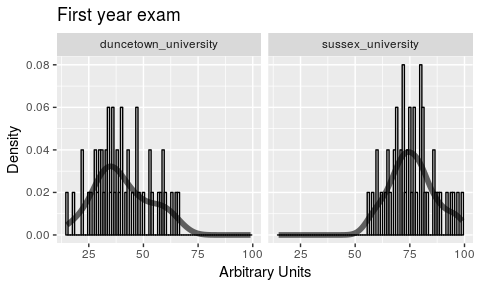

Plotting a histogram per group using `dplyr::filter()`; `numeracy`
------------------------------------------------------------------

``` r
plot_numeracy <- rexam_long %>%
  dplyr::filter(measure == "numeracy") %>%
    ggplot(aes(x = value)) +
  geom_histogram(aes(y = ..density..), 
                 fill = "white", 
                 colour = "black", 
                 binwidth = 1) + 
  labs(x = "Arbitrary Units", y = "Density") + 
  ggtitle("Numerical literacy") +
  geom_line(aes(y = ..density..), colour=26, stat = 'density', size = 2, alpha = .6) +
  facet_wrap(~ uni)
```

Plot `numeracy`
---------------

``` r
plot_numeracy
```

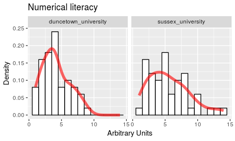

qqplots for the two variables
-----------------------------

``` r
qplot(sample = rexam$exam, stat="qq")
```

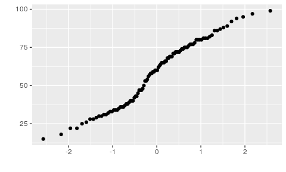

``` r
qplot(sample = rexam$numeracy, stat="qq")
```

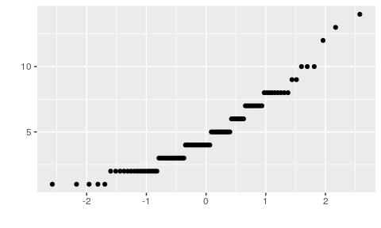

Testing for equal variance (sample estimates)
---------------------------------------------

$s\_2 = {\\frac{1}{{N - 1}}\\sum\\limits\_{i = 1}^N {\\left( {x\_i - \\bar x} \\right)^2 } }$

$sd = {\\sqrt\\frac{1}{{N - 1}}\\sum\\limits\_{i = 1}^N {\\left( {x\_i - \\bar x} \\right)^2 } }$

Levene's Test
-------------

``` r
leveneTest(rexam$exam, rexam$uni)
leveneTest(rexam$exam, rexam$uni, center = mean)
leveneTest(rexam$numeracy, rexam$uni)
```

Fixing data errors and data transformations
===========================================

Transforming data
-----------------

-   To remove skewness or kurtosis
-   Apply the ***same*** transformation to ***all variables***
-   After transformation and analysis, sometimes you need to inverse-transform
-   It can be a time comsuming process: 'trial-and-error'

--&gt; Exercise
